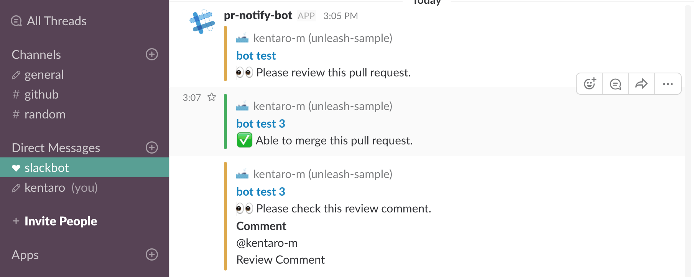
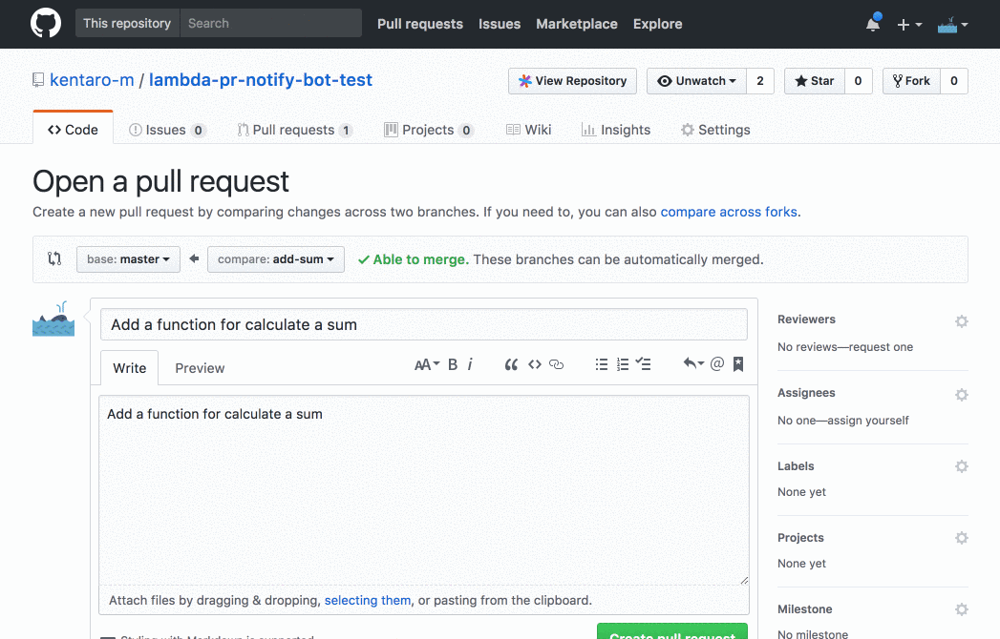
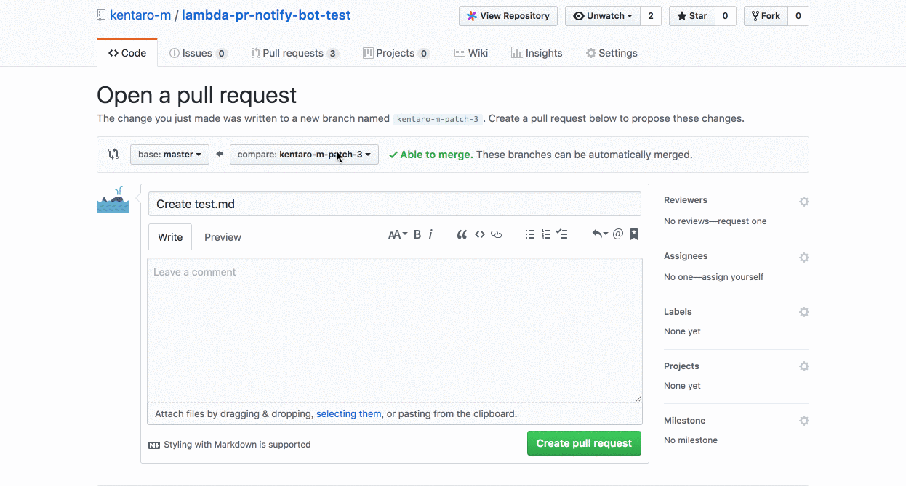
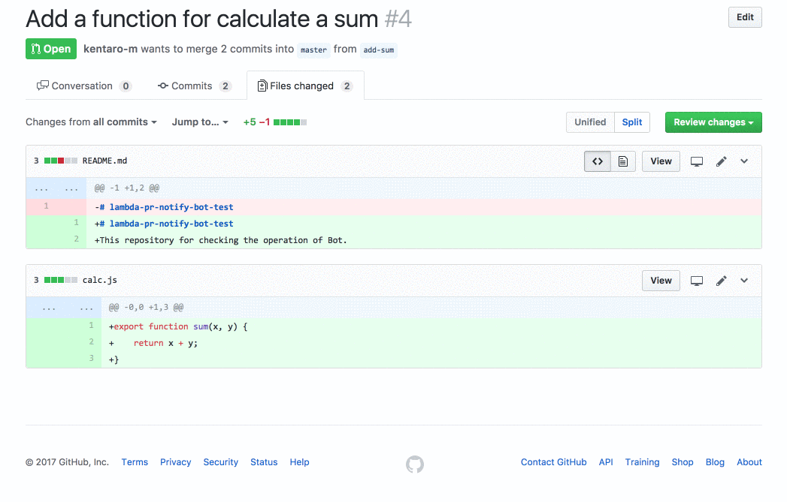
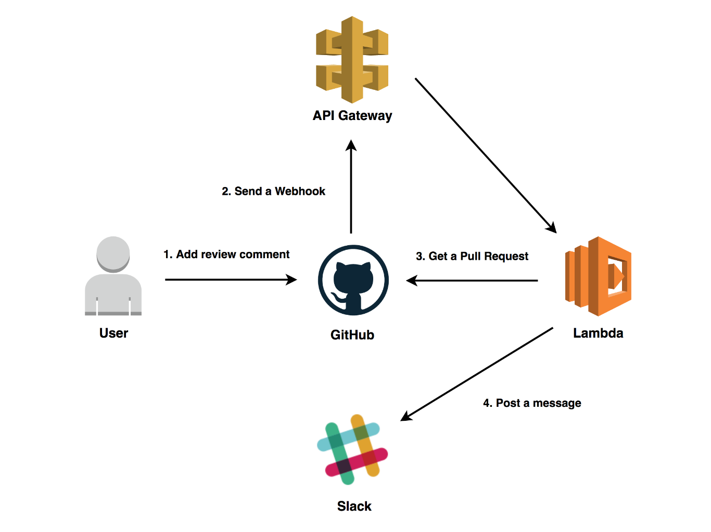

# lambda-pr-notify-bot

[](https://circleci.com/gh/kentaro-m/lambda-pr-notify-bot)
[](https://github.com/kentaro-m/lambda-pr-notify-bot/blob/master/LICENSE)

:robot: A bot that improve pull request workflow on GitHub.



## Features

* :arrows_clockwise: Add automatically reviewers to pull request
* :bell: Send a direct messages to Slack
  * When the pull request is opened
  * When the pull request is approved
  * When the pull request is added mention comment
* :pushpin: Manege WIP pull request by using a label

## Configuration

### How to create oauth token for send messages to Slack

1. Access to [Your Apps](https://api.slack.com/apps)
2. Click the Create New App
3. Input App Name and Development Slack Workspace
4. Select Permissions in Add features and functionality
5. Add `chat:write:bot` in Permission Scopes
6. Create a token
7. Copy OAuth Access Token

### How to create oauth token for request GitHub API.

1. Access to [Personal access tokens](https://github.com/settings/tokens)
2. Click the Generate new token
3. Input description in Token description
4. Add `repo` in Select scopes
5. Create a token
6. Copy OAuth Access Token

### How to run the bot on AWS

```
$ git clone https://github.com/kentaro-m/lambda-pr-notify-bot.git
$ cd lambda-pr-notify-bot
$ npm install
$ npm run package
```

Installing packages and building code.

```
{
  "host": "", // Required if using GitHub Enterprise
  "pathPrefix": "", // Required if using GitHub Enterprise
  "repositories": [ // Repositories that allows bot actions
    "unleash-sample"
  ],
  "reviewers": [ // Pull request reviewers (GitHub username)
    "matsushita-kentaro"
  ],
  "approveComments": [ // Comment on approving pull request
    "+1",
    "LGTM"
  ],
  "numApprovers": 1, // Number of people required for pull request approval
  "slackUsers": { // Association between Slack user name and Github user name
    "matsushita-kentaro": "kentaro",
    "kentaro-m": "kentaro"
  },
  "message": { // Message to notify to Slack
    "requestReview": "Please review this pull request.",
    "ableToMerge": "Able to merge this pull request.",
    "mentionComment": "Please check this review comment."
  },
  "labels": {
    "wip": {
      "name": "wip", // display label name
      "color": "efb85f" // label color
    }
  },
  "workInProgress": true, // Bot manages WIP pull request by using a wip label
  "assignReviewers": true, // Bot adds a assignees to the pull request
  "requestReview": true, // Bot adds a reviewers to the pull request
  "ableToMerge": true, // Notify Slack that pull requests can be merged
  "mentionComment": true // Notify mention comment to Slack
}
```

Add reviewers (GitHub username), repositories and Slack username to `config/default.json`. Also, if necessary change other setting items.

* **GITHUB_API_TOKEN** A token for obtaining information on pull requests (scope: repo)
* **SLACK_API_TOKEN** A token for sending messages to Slack (scope: chat:write:bot)
* **SECRET_TOKEN** A token for securing webhook

Add environment variables to pr-notify-bot.yml. (or Add environment variables on the Lambda management console.)

```
$ aws cloudformation package --template-file pr-notify-bot.yml --s3-bucket <Your bucket name> --output-template .sam/packaged.yml
$ aws cloudformation deploy --template-file ./.sam/packaged.yml --stack-name <Your stack name> --capabilities CAPABILITY_IAM
```

Upload the SAM template to S3 and deploy it.

### How to set up webhook on GitHub

* Go to your project (or organization) settings > Webhooks > Add webhook
* **Payload URL** `https://<API ID>.execute-api.<AWS Region>.amazonaws.com/<Stage Name>/webhook`
* **Content type** `application/json`
* **Secret** any value
* **Events** Pull request, Pull request review, Pull request review comment, Issue comment

### Options: Execute a Lambda Function on VPC

Please use it when assigning a static IP to execute a Lambda Function. Also, if necessary, please specify security group and subnet as parameters (An array of literal strings that are separated by commas.).

* **SecurityGroupIds** The list of Security Group IDs for the HTTPS Access.
* **PrivateSubnetIds** The list of VPC Private Subnet IDs for running the Lambda Function.

```
$ aws cloudformation package --template-file pr-notify-bot-on-vpc.yml --s3-bucket <Your bucket name> --output-template .sam/packaged.yml
$ aws cloudformation deploy --template-file ./.sam/packaged.yml --stack-name <Your stack name> --parameter-overrides SecurityGroupIds=<SecurityGroupIds value> PrivateSubnetIds=<PrivateSubnetIds value> --capabilities CAPABILITY_IAM
```

## Usage

### Add automatically reviewers to pull request



1. Pull request is created
2. Add automatically reviewers to the pull request
3. Send a direct message to Slack

### Manege WIP pull request by using a label



1. Create a pull request by including WIP in the title
2. Add automatically wip label to the pull request
3. Remove wip label, when the pull request is ready for review
4. Add automatically reviewers to the pull request

### Send a direct messages to Slack



* When the pull request is opened
* When the pull request is added mention comment
* When the pull request is approved

## Architecture



## License

MIT
